  

<h1 align="center">Meridian</h1>
<h3 align="center">
  Hi, I'm Meridian.  
  I am a hobby developer & software engineer coding for fun.  
  I'm currently learning multiple skills such as 
   JavaScript &
   TypeScript,
   Back- &
   Front-End development and
   React. 
</h3>

# About me

## I've worked with:

### Languages

### Frameworks

### Software & Tools

## Contact

 

 

## Stats

